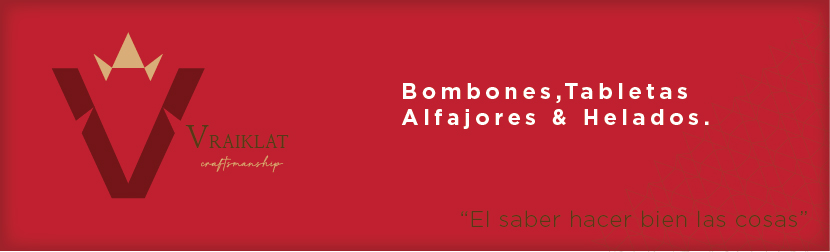
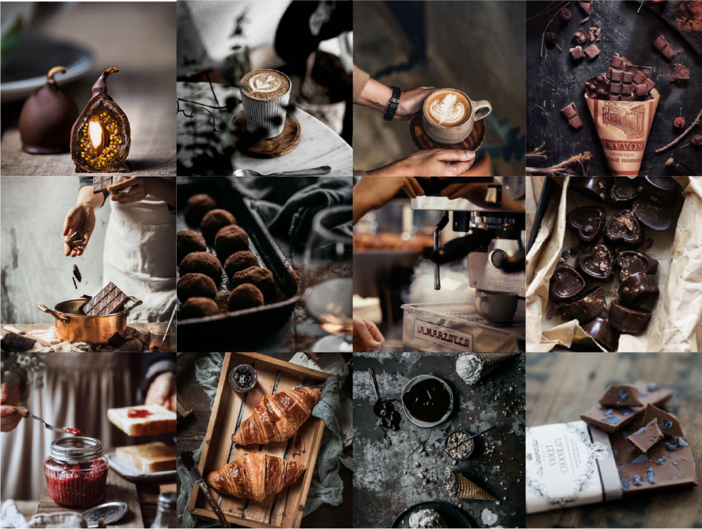
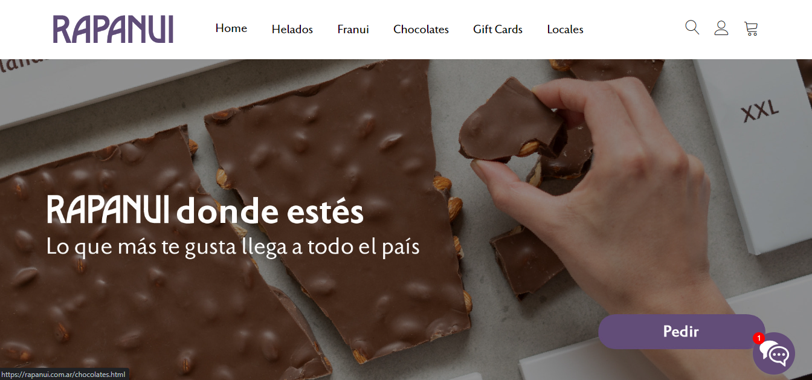
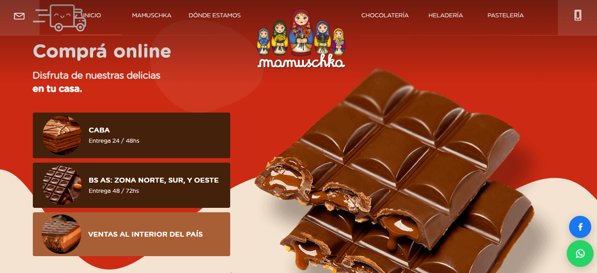
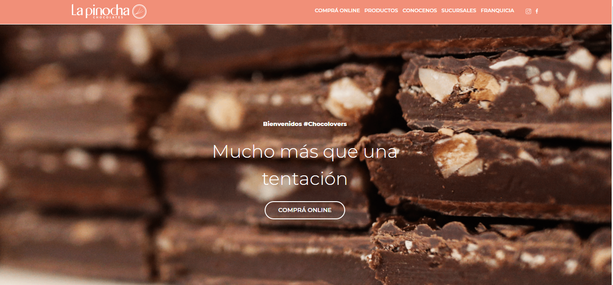
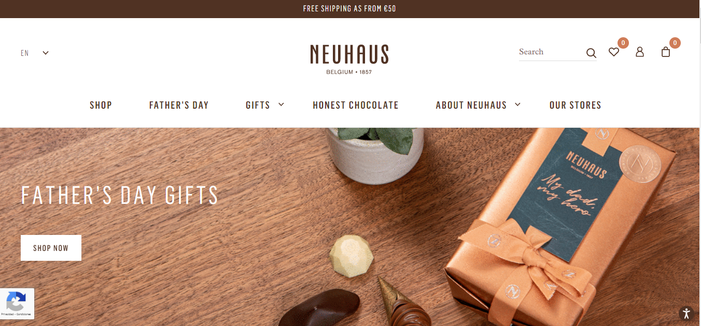
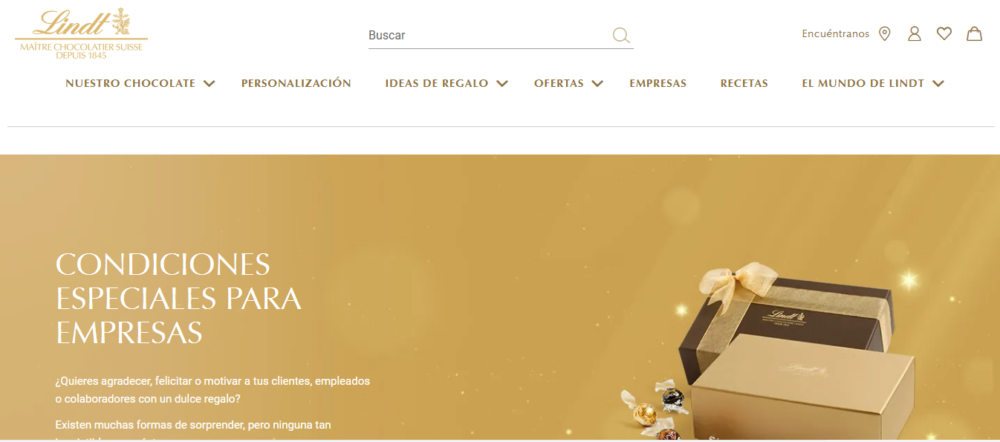

<h1 align="center" style = "color: #D9AD77;font-weight: bold;">E-commerce VRAIKLAT</h1>

### TRELLO - TABLERO DE TRABAJO
[Ir a Trello](https://trello.com/b/xAFR0VXU/agile-board "Ir a trello")

### BRIEFING
------------
Vraiklat es una marca que ofrece chocolates y helados artesanales y productos regionales, es una marca elegante y flexible que representa:
>"El saber hacer bien las cosas"

------------
### IDENTIDAD 
La identidad es uno de los elementos fundamentales que componen a un e-commerce. Tener una marca sólida y coherente es lo que posibilita ser reconocida, por lo que es importante definir líneas de imagen previamente establecidas.

Congruentes con aquello que se busca transmitir. Buscamos que los consumidores asocien a **Vraiklat** como un e-commerce de chocolatería artesanal de calidad, por lo tanto, la imagen y comunicación estarán orientadas a dicho reconocimiento.
A través de la comunicación, tanto visual como escrita, se buscará transmitir sabores, aromas y texturas que generan emociones nostálgicas en los compradores y los transportan a momentos y lugares donde fueron felices. Asimismo, se recrearán imágenes relacionadas con la calidez del hogar y las tradiciones familiares.

------------

### IMAGENES
Las imágenes que mejor representan a **Vraiklat** son aquellas que son atractivas y cercanas. Con colores no excesivamente saturados. La mayoría de las imágenes que se van a utilizar son de productos, aunque de vez en cuando se incluirán fotografías en las que aparecen personas. El estilo fotográfico se caracteriza por el uso de luz natural, colores cálidos y fondos oscuros. El fin es transmitir la calidez de una cabaña en el medio del bosque resguardada del frío y la nieve.

El moodboard es una referencia del estilo fotográfico que describimos anteriormente.
Consideramos que este estilo de imágenes son las que mejor transmiten el mensaje y el valor de la marca. Es un estilo de foodstyling originario del norte de Europa que, si bien es clásico y rústico, es actual y se prevé que será tendencia en los próximos años.
El objetivo es cuidar el producto y cada detalle.

------------

### PRODUCTOS 

- **TABLETAS RELLENAS**
El arte de macerar las frutas y combinarlas es una exclusividad y un toque único de Vraiklat. Los legendarios procedimientos de elaboración y las cuidadas recetas los convierte en un producto único, sabroso y característico en cada mordisco.

- **TABLETAS SECAS**
Un clásico en nuestro catálogo. Exquisitas tabletas de chocolate y una irresistible combinación con frutos secos de la más alta calidad.

- **BOMBONES**
Los bombones son otra de las inigualables "tentaciones de Vraiklat". La magia del chocolate se combina con la mejor selección de frutas finas, licores, frutos secos y dulce de leche, logrando auténticos e inconfundibles sabores. Si elegís uno de cada uno, tu caja de bombones tendrá más de veinte variedades!

-  **HELADOS**
Ofrecemos los helados de "frutas al natural". No es el tradicional helado de agua. Es un novedoso helado de frutas que tiene la fruta fresca en sí misma con todo su jugo, tan colorida y gustosa que se te hace realmente agua la boca. Claro que también tenemos las cremas de fruta, variedades en helados de chocolate, 4 tipos de dulce de leche, las cremas tramontana y tiramisú (típicos sabores europeos).

- **ALFAJORES**
Para Vraiklat, nada es imposible y nada mejor que deleitarnos con un clásico de los argentinos. Un producto que no es un simple y vulgar dulce, sino todo un compendio de nutrientes, un verdadero alimento. Más sabor... imposible!
Nuestros alfajores están disponibles en diferentes presentaciones:
  - Dulce de leche bañado en chocolate blanco
  - Dulce de leche bañado en chocolate semiamargo
  - Rellenos con Mousse de chocolate 
  - Rellenos con Mousse de frutilla 
  - Rellenos con Mousse de frambuesa 
  - Rellenos con frutos del bosque
  - Bañados con trocitos de nuestra mejor selección de almendras 

------------
### PÚBLICO OBJETIVO
El público objetivo al cual va dirigido el e-commerce y su comunicación es a personas entre las edades de 25 años en adelante, con recursos económicos medios. Es una persona que idealiza Europa y la calidad en productos.
 

------------
### REFERENCIAS

- **RAPANUI**
[Ir a Rapanui](https://rapanui.com.ar "Ir a Rapanui")

Considerada una marca líder en el rubro de chocolaterías, heladerías y cafeterías. Con varios años en la ciudad y un crecimiento exponencial en los últimos tiempos. Cuentan con 11 locales en todo el país y se pueden adquirir sus productos en todas las provincias. Utilizan campañas simples junto con fotos de una gran definición y detalles.

- **MAMUSCHKA**
[Ir a Mamuschka](https://www.mamuschka.com "Ir a Mamuschka")

Marca originada en Bariloche y en expansión a varias ciudades del país. En los últimos años comenzó a incursionar en el rubro de heladería. Tiene como identidad el color rojo, que se encuentra en la mayoría de sus productos.

- **LA PINOCHA**
[Ir a la Pinocha](https://www.lapinochachocolates.com "Ir a la Pinocha")

Empresa que nació en Mar de las Pampas, se dedica a la chocolatería y desde su origen en el interior logró posicionarse en Buenos Aires y contar con 17 locales. Utilizan su logo borravino característico en la mayoría de sus publicaciones.

- **NEUHAUS**
[Ir a Neuhaus](https://www.neuhauschocolates.com "Ir a Neuhaus")

Compañía fundada en Bruselas en 1857. Todos sus productos siguen fabricándose en Bélgica, desde donde se exportan a todo el mundo y cuenta con 1000 puntos de venta en 40 países. 

- **LINDT**
[Ir a Lindt](https://www.lindt.es "Ir a Lindt")

Lindt es una compañía de origen suizo dedicada a la fabricación y comercialización de chocolates y productos de confitería. Su sede central se encuentra en Zúrich, Suiza, pero sus operaciones se extienden a todo el mundo.

------------
<h3 align="center" style = "color: #BF212E;font-weight: bold;">INTEGRANTES</h3>

- **Nicolas Andorno** 

Tengo 23 años, de Argentina. Interesado en la computación y programación.

- **Mauro Bonavota**

Soy licenciado en higiene y seguridad laboral. Instructor en formación técnica, me atrapan los desafíos y la innovación constante. Convencido de que el desarrollo industrial va de la mano de la formación constante y de vanguardia. Ya que la evolución de las tecnologías y nuevas formas de trabajo no se detiene.

- **Leandro Aguilar**

Soy Ingeniero Industrial, fanático de la tecnología y la innovación y apasionado por el conocimiento motivado y movido por asumir retos en la vida, especialista en optimización de sistemas industriales, estudio de tiempos y organización de trabajo.

- **Diego Gonzalez Palau**

Ingeniero agrónomo, de Córdoba capital, emprendedor y Me gusta viajar. Amante de los deportes y explorando este nuevo mundo de la programación

